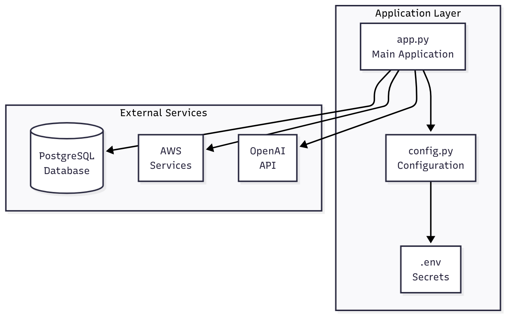

# from-lab-to-hub

A simple data processing application for workshop demonstration purposes.

## Project Status


This project is actively maintained for workshop demonstration purposes.

## Technology Stack

- **Language:** Python 3.x
- **Database:** PostgreSQL
- **Cloud Services:** AWS (S3, EC2)
- **AI Integration:** OpenAI API

## Dependencies

- `requests>=2.28.0` - HTTP library
- `psycopg2-binary>=2.9.0` - PostgreSQL adapter
- `python-dotenv>=1.0.0` - Environment variable management
- `openai>=1.0.0` - OpenAI API client
- `boto3>=1.26.0` - AWS SDK for Python

## Installation

1. Clone the repository:
```bash
git clone <repository-url>
cd from-lab-to-hub
```

2. Create a virtual environment:
```bash
python -m venv venv
source venv/bin/activate  # On Windows: venv\Scripts\activate
```

3. Install dependencies:
```bash
pip install -r requirements.txt
```

4. Configure environment variables:
```bash
cp .env.example .env
# Edit .env with your actual credentials
```

## Architecture Diagrams



## Known Issues

- This is a demonstration project; database connections are simulated
- API calls are mocked and do not make real requests

## License

MIT License

## Documentation and Resources

- [Python dotenv documentation](https://pypi.org/project/python-dotenv/)
- [PostgreSQL Python Tutorial](https://www.postgresqltutorial.com/postgresql-python/)
- [OpenAI API Reference](https://platform.openai.com/docs/api-reference)
- [AWS Boto3 Documentation](https://boto3.amazonaws.com/v1/documentation/api/latest/index.html)

## Credits and Acknowledgments

- INESC TEC - Center for Power and Energy Systems (CPES)
- Workshop participants and contributors
